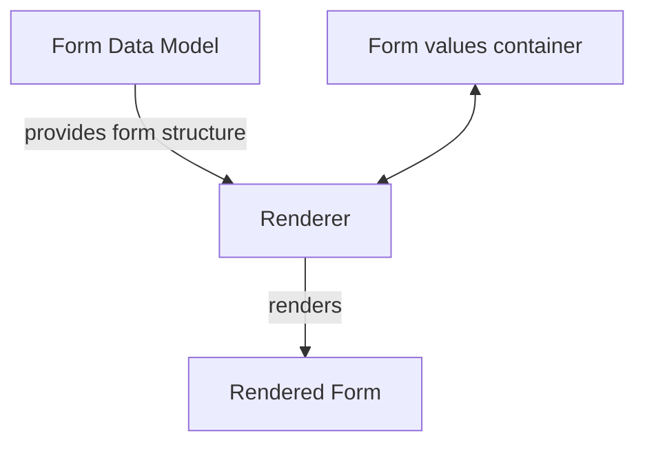
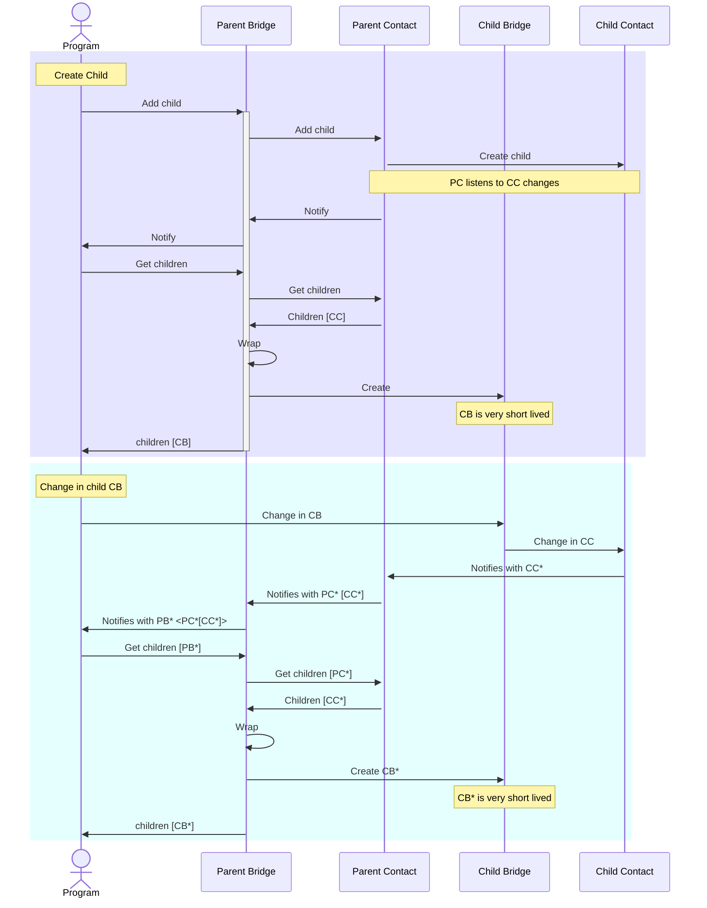

# iCure Form System

## Description

This is a form system for the iCure project. It is a web framework that allows users to create forms, fill them out, and view the results. The system is built using Lit framework to make it as light as possible and easy to integrate in any higher level framework.

## How to use

```bash
yarn add @icure/form
```

```javascript
import '@icure/form';
```

Inside your JS file import a theme:

```javascript
import '@icure/form/themes/icure-blue';
```

and add the following tag:

```html
<icure-form
	.form="${this.form}"
	labelPosition="top"
	renderer="form"
	language="en"
	.formValuesContainer="${this.formValuesContainer}"
	.optionsProvider="${this.optionsProvider}"
	.translationProvider="${this.translationProvider}"
	.ownersProvider="${this.ownersProvider}"
	.actionListener="${this.actionListener}"
></icure-form>
```

## Data model

### Form

The Form class represents an entire form, encapsulating its metadata and structure, including sections and fields. It provides methods to parse form data from JSON and to serialize form instances back into JSON format.

#### Properties

- form: string - The title of the form.
- sections: Section[] - An array of sections that the form comprises.
- id: string - An optional identifier for the form.
- description: string - An optional description of the form.
- keywords: string[] - Optional keywords associated with the form.
- codifications: Codification[] - Optional codifications for the form.
- translations: TranslationTable[] - Optional translations for the form.

### Section

The Section class represents a section within a form. A section groups related fields together and can have its own metadata such as a title, description, and keywords.

#### Properties

- section: string - The title of the section.
- fields: (Field | Group | Subform)[] - An array of fields, sub-forms and groups contained within the section.
- description: string - An optional description of the section.
- keywords: string[] - Optional keywords associated with the section.

### Field

The Field class represents a generic field within a form. It is designed to be extended by specific field types, each providing additional properties and behaviors.

#### Properties

- field: string - The label/identifier of the field. This is the name used to reference the field in formulas and computed properties.
- type: FieldType - The type of the field. See [Implementations](#implementations) for valid type strings.
- shortLabel: string - An optional short label for the field.
- grows: boolean - Optional property indicating if the field can grow vertically.
- schema: IcureTextFieldSchema - Optional ProseMirror schema variant for text fields (e.g., `'styled-text-with-codes'`, `'text-document'`, `'tokens-list'`, `'date'`, `'measure'`, etc.).
- span: number - Optional property indicating the column span of the field (out of a 24-column grid). Defaults to 6.
- rowSpan: number - Optional property indicating the row span of the field. Defaults to 1.
- tags: string[] - Optional tags associated with the field.
- codifications: string[] - Optional codifications for the field.
- readonly: boolean - Optional property indicating if the field is read-only.
- options: Record<string,unknown> - Optional field options.
- labels: Labels - Optional labels for the field. Labels is `Partial<Record<'top' | 'left' | 'right' | 'bottom' | 'float' | 'add' | 'remove', string>>`.
- value: string - Optional value of the field.
- unit: string - Optional unit of the field (used by measure fields).
- multiline: boolean - Optional property indicating if a text field supports multiple lines.
- computedProperties: Record<string, string> - Optional computed properties for the field, any property of the field can be computed. A computed property will replace the value provided independently.
- defaultValue: string - Optional default value formula for the field, used when the form is created.
- validators: Validator[] - Optional validators for the field. See [Validators](#validators).
- translate: boolean - Optional property indicating if the field supports translation. Defaults to true.
- now: boolean - Optional property for date/time picker fields. When true, the field defaults to the current date/time.
- sortOptions: SortOptions - Optional sorting configuration for choice fields (dropdown, radio-button, checkbox). See [SortOptions](#sortoptions).
- hasOther: boolean - Optional property for radio button fields. When true, an "other" free-text option is shown.
- event: string - Optional event name for action/button fields.
- payload: unknown - Optional payload for action/button fields.
- width: number - Optional fixed width of the field in pixels.
- styleOptions: { width: number, direction: string, span: number, rows: number, alignItems: string } - Optional style options for the field.

#### Implementations

The Field class has several specific implementations, each tailored to handle different types of input within a form. Here are the possible implementations:

| Class | Type string | Description |
|---|---|---|
| TextField | `text-field` | A very flexible field that allows the user to input a single line of text or to provide a fully customizable text editor with styling options. |
| TokenField | `token-field` | A field that allows the user to handle a tokenized list of items. |
| ItemsListField | `items-list-field` | A field that allows the user to handle a list of items. |
| DatePicker | `date-picker` | A field that allows the user to input a date (date pickers are supported). |
| TimePicker | `time-picker` | A field that allows the user to input a time (time pickers are supported). |
| DateTimePicker | `date-time-picker` | A field that allows the user to input a date and time (date-time pickers are supported). |
| NumberField | `number-field` | A field that allows the user to input a number. |
| MeasureField | `measure-field` | A field that allows the user to input a number with a unit. |
| DropdownField | `dropdown` | A field that allows the user to select an option from a dropdown list. |
| RadioButton | `radio-button` | A field that allows the user to select an option from a list of radio buttons. |
| CheckBox | `checkbox` | A field that allows the user to select one or more options from a list of checkboxes. |
| Label | `label` | A static label/text element. |
| Button | `action` | A button that can trigger events with an optional payload. |

Note: When a type string is not recognized during parsing, it defaults to TextField.

### Validators

The Validator interface defines a validation rule for a field:

```typescript
interface Validator {
	validation: string  // A JavaScript formula that returns a boolean (true = valid)
	message: string     // The error message to display (can be a translation key)
}
```

Validators are evaluated using the same sandbox as computed properties. The `self` object gives access to all field values in the form.

Example:
```yaml
validators:
  - validation: |
      return validate.notBlank(self, 'my-field-label')
    message: This field is required
  - validation: |
      const value = parseContent(self['my-number-field']?.[0]?.content) ?? 0
      return value >= 0 && value <= 100
    message: Value must be between 0 and 100
```

### SortOptions

Sort options control the ordering of choices in dropdown, radio-button, and checkbox fields:

```typescript
interface SortOptions {
	sort: 'asc' | 'desc' | 'natural'
	promotions?: string  // Comma-separated list of code ids to promote to the top
}
```

Example:
```yaml
sortOptions:
  sort: natural
  promotions: "none, *, empty, other"
```

### Computed Properties

Computed properties allow you to dynamically calculate the value of a field property or the value of the field itself based on other values in the form. The `computedProperties` field is a map where the key is the name of the property to compute and the value is a JavaScript formula (as a string) that returns the value for that property.

#### Field Properties

You can compute standard properties of a field (e.g., `readonly`, `hidden`, `label`, `span`, `styleOptions`). The formula is evaluated, and the result is directly assigned to the property.

Example:
```yaml
computedProperties:
  readonly: "return age > 18"
  hidden: "return !self['show-details']?.some((item) => item?.codes.some(code => code.id === 'yes'))"
  label: "return age > 18 ? 'Adult comment' : 'Child comment'"
```

The `hidden` computed property is particularly useful: when it evaluates to `true`, the field (or group, or subform) is not rendered at all.

#### Field Value (`value` and `defaultValue`)

Two special keys control the content of the field:

- **`defaultValue`**: Calculates the initial value of the field. This formula is evaluated when the form is initialized, and only if the field is empty.
- **`value`**: continuously calculates the value of the field. This overrides any manual input.

#### Return Value Format

When computing the value of a field (via `defaultValue` or `value`), the return value of the formula is automatically converted to the internal `FieldValue` format (`{ content: ..., codes: ... }`). The conversion rules are:

- **`FieldValue` object**: Used as is.
- **`number`**: Converted to `{ content: { '*': { type: 'number', value: ... } } }`.
- **`string`**: Converted to `{ content: { '*': { type: 'string', value: ... } } }`.
- **`boolean`**: Converted to `{ content: { '*': { type: 'boolean', value: ... } } }`.
- **`Date`**: Converted to a timestamp content (formatted as YYYYMMDDHHmmss).
- **`{ value: number, unit: string }`**: Converted to `{ content: { '*': { type: 'measure', value: ..., unit: ... } } }`.
- **Array**: Converted to a compound content.

#### Available functions

Formulas can use the [built-in functions](#built-in-functions) defined in the Form Values Container, such as `hasOption`, `score`, `text`, `parseContent`, etc.

### Computed Properties

Computed properties allow you to dynamically calculate the value of a field property or the value of the field itself based on other values in the form. The `computedProperties` field is a map where the key is the name of the property to compute and the value is a JavaScript formula (as a string) that returns the value for that property.

#### Field Properties

You can compute standard properties of a field (e.g., `readonly`, `hidden`, `label`, `styleOptions`). The formula is evaluated, and the result is directly assigned to the property.

Example:
```yaml
computedProperties:
  readonly: "return age > 18"
  label: "return age > 18 ? 'Adult comment' : 'Child comment'"
```

#### Field Value (`value` and `defaultValue`)

Two special keys control the content of the field:

- **`defaultValue`**: Calculates the initial value of the field. This formula is evaluated when the form is initialized, and only if the field is empty.
- **`value`**: continuously calculates the value of the field. This overrides any manual input.

#### Return Value Format

When computing the value of a field (via `defaultValue` or `value`), the return value of the formula is automatically converted to the internal `FieldValue` format (`{ content: ..., codes: ... }`). The conversion rules are:

- **`FieldValue` object**: Used as is.
- **`number`**: Converted to `{ content: { '*': { type: 'number', value: ... } } }`.
- **`string`**: Converted to `{ content: { '*': { type: 'string', value: ... } } }`.
- **`boolean`**: Converted to `{ content: { '*': { type: 'boolean', value: ... } } }`.
- **`Date`**: Converted to a timestamp content (formatted as YYYYMMDDHHmmss).
- **`{ value: number, unit: string }`**: Converted to `{ content: { '*': { type: 'measure', value: ..., unit: ... } } }`.
- **Array**: Converted to a compound content.

#### Available functions

Formulas can use the [built-in functions](#built-in-functions) defined in the Form Values Container, such as `hasOption`, `score`, `text`, `parseContent`, etc.

### Codification

The Codification class represents a codification for a form or field. It is used to associate a code with a specific value, allowing for standardized data entry and analysis.
Commonly used codifications include ICD-10, ICPC-2, SNOMED-CT, and LOINC.
Codification systems can be specified at the form level but external codification providers can also be used.

### Translations

Translations can be provided at the form level or be provided by external translation providers.

## General architecture



The form is defined by a Form object that contains all the necessary information to represent the form.
The renderer is responsible for rendering the form based on the form object. Several renderers can be implemented to render the form in different ways (e.g. as a web form, as a one section by page form (à la typeforms)).
The form values container is responsible for storing the values of the form. The form values container is immutable and can be modified by creating a new form values container with the desired modifications.

### The form values container

All form value containers must implement a FormValuesContainer interface that declares the following methods:

- `compute(formula: string, sandbox?: S): Promise<T | undefined>` : computes a formula based on the values of the form, inside a provided sandbox. If no sandbox is provided, the default sandbox is used. Returns a promise.
- `getLabel(): string` : returns the label of the form values container (used to display the title of the form in hierarchical contexts)
- `getFormId(): string | undefined` : returns the id of the form values container
- `getDefaultValueProvider(label: string): (() => Promise<FieldValue | undefined>) | undefined` : returns a function that provides the default value for a specific field label.
- `getDefaultValueProvider(label: string): (() => Promise<FieldValue | undefined>) | undefined` : returns a function that provides the default value for a specific field label.
- `getValues(revisionsFilter: (id: string, history: Version<Metadata>[]) => (string | null)[]): VersionedData<Value>` : obtains the values to be displayed in the form, using a filter to select the desired versioned data that are to be displayed in a specific field.
- `getMetadata(id: string, revisions: (string | null)[]): VersionedData<Metadata>` : obtains the metadata of a specific value, for the specified revisions.
- `getValidationErrors(): Promise<[FieldMetadata, string][]>`: returns a promise of the validation errors of the form values container for the values that are currently stored in it.
- `getChildren(): Promise<FormValuesContainer<Value, Metadata>[]>` : returns a promise of the children of the form values container.
- `setValue(label: string, language: string, data?: Value, id?: string, metadata?: Metadata): void` : modifies the value associated to a field in the form values container. The change is propagated through change listeners.
- `setMetadata(metadata: Metadata, id?: string): void` : modifies the metadata associated to a value in the form values container.
- `delete(valueId: string): void` : deletes a value from the form values container.
- `addChild(anchorId: string, templateId: string, label: string): Promise<void>`: adds a child to the form values container.
- `removeChild(container: FormValuesContainer<Value, Metadata>): Promise<void>` : removes a child from the form values container.
- `registerChangeListener(listener: (newValue: FormValuesContainer<Value, Metadata>) => void): void` : registers a listener that will be called whenever the form values container is modified.
- `unregisterChangeListener(listener: (newValue: FormValuesContainer<Value, Metadata>) => void): void` : unregisters a listener that was previously registered.
- `synchronise(): FormValuesContainer<Value, Metadata>`: makes sure the hierarchy of form value containers listeners is correctly connected internally. This method has to be called when a form value container that has been extract from a undo redo stack is reused.

It is very important to understand that the renderer has no knowledge of the inner-workings of the form values container.
It only knows how to render the form based on the form object and the values that are stored in the form values container.
The form values container is responsible for storing the values of the form and for providing the values to the renderer in a way that the renderer can understand, namely by providing values of the FieldValue type and metadata of the FieldMetadata type.

We cannot state enough how important it is to keep the form values container immutable. While this can seem cumbersome at first, it is a very powerful pattern that allows for easy undo/redo functionalities, easy state management, and easy debugging.
It also allows for optimisations as the values of the form values container can be reused in a new form values container if they have not changed.

It is also very important in the design to keep all code that is not under src/icure and src/conversion completely agnostic in terms of data model.
For example, it is not a good idea to make assumptions about the kind of data structure that are going to be available to the fields (like relying on it being a Service).

#### Built-in functions

When using the `compute` method, the following functions and objects are available in the sandbox:

- **hasOption(item, option)**: Returns `true` if the item contains a code where the id equals `option` or the part after `|` equals `option`.
- **score(item)**: Calculates the total score by summing up the integer values found in the codes of the item (specifically the part of the code id after `|`).
- **text(item)**: formatting function that converts a field value (or an array of values) into a comma-separated string.
- **parseContent(content, toString)**: Helper function to extract and parse the content of a value, optionally converting it to a string.
- **validate.notBlank(self, label)**: a validation helper ensuring a specific field is not empty.
- **log**: direct access to console.log.
- **self**: a proxy object that gives access to all form field values by their field label. For example, `self['my-field']` returns an array of versioned values for that field.

The following standard JavaScript builtins are also available: `parseInt`, `parseFloat`, `Date`, `Math`, `Number`, `String`, `Boolean`, `Array`, `Object`, `Promise`.

Note: field values are also accessible directly by their label as variables in the formula scope. For example, if a field has `field: weight`, you can reference it as `weight` in a formula (equivalent to `self['weight']`).


### The renderer

The renderer is instantiated by the icure-form component and is responsible for rendering the form based on the form object and the form values container.

The icure-form component accepts the following properties:

- form: Form - the form object that represents the form to be rendered
- renderer: string - the name of the renderer to be used. Supported values: `"form"` (standard layout) and `"form:tab"` (renders each section as a tab).
- visible: boolean - a boolean indicating if the form should be visible or not. Defaults to true.
- readonly: boolean - a boolean indicating if the form should be read-only or not. Defaults to false.
- displayMetadata: boolean - a boolean indicating if metadata (owner, date, etc.) should be displayed on fields. Defaults to false.
- labelPosition: string - the favoured position of the labels in the form. Valid values: `'top'`, `'left'`, `'right'`, `'bottom'`, `'float'`. This option can or cannot be honoured by the renderer.
- formValuesContainer: FormValuesContainer<FieldValue, FieldMetadata> - the form values container that contains the values of the form
- language: string - the language in which the form should be displayed
- languages: { [iso: string]: string } - a map of ISO language codes to display names for multi-language support
- optionsProvider: (language: string, codifications: string[], terms?: string[]) => Promise<Suggestion[]> - an optional provider that provides options for some fields of the form (like dropdown fields)
- translationProvider: (language: string, text: string) => string - an optional provider that provides translations for the form
- ownersProvider: (terms: string[], ids?: string[], specialties?: string[]) => Promise<Suggestion[]> - an optional provider that provides owner suggestions
- actionListener: (event: string, payload: unknown) => void - an optional listener for action/button events

### Themes

Themes can be applied to renderers by importing one theme before importing/instantiating the icure-form component.
The available themes are:

- `default` - Minimal base theme
- `icure-blue` - Blue EHR-lite theme
- `kendo` - Kendo UI-inspired theme

```javascript
import '@icure/form/themes/icure-blue'
```

### Listeners and notifications

Listeners are being used to update the form values container when they are modified. As the form values container is immutable, it is necessary to create a new form values container when a modification is made.
This new form values container is then passed to the listeners that are registered to the original form values container. The listeners is the only part of the form values container that is mutable.
In a way, the listeners are not really part of the form values container, but are rather a kind of metadata. In a hierarchy of form values containers, the listeners that connect the form values containers together are maintained automatically.
However, when a form values container is extracted from a undo/redo stack, the hierarchy of listeners has to be restored. In this case, the synchronise method has to be called to make sure the hierarchy is correctly connected.

You'll find here a sequence diagram that shows how notifications are listened to and propagated in the form system:



### JSON/YAML representation

The form can be represented in JSON or YAML format. Here is an example of a form in JSON format:

```json
{
	"form": "Example form",
	"sections": [
		{
			"section": "Section 1",
			"fields": [
				{
					"field": "Field 1",
					"type": "text-field",
					"tags": ["tag1", "tag2"],
					"options": {
						"placeholder": "Enter text here"
					}
				},
				{
					"field": "Option 1",
					"type": "checkbox"
				}
			]
		}
	]
}
```

And here is the same form in YAML format:

```yaml
form: Example form
sections:
  - section: Section 1
    fields:
      - field: Field 1
        type: text-field
        options:
          placeholder: Enter text here
        tags:
          - tag1
          - tag2
      - field: Option 1
        type: checkbox
```

A form can have `codifications`, `translations` and `subForms` defined, to be references in sub-forms.

```yaml
form: Example form
codifications:
  - type: MS-ABORTION-COMPANION-TYPE
    codes:
      - id: partner
        label:
          nl: Partner
          fr: Partenaire
      - id: friend
        label:
          nl: Vriend(in)
          fr: Ami(e)
translations:
  - language: fr
    translations:
      Confirm: Valider
      Present: Présent
      BMI: IMC
  - language: nl
    translations:
      Confirm: Bevestig
      Present: Aanwezig
      BMI: BMI
subForms:
  c789794e-d0f4-8988-1234-e758a782473b:
    form: BMI
    description: BMI
    sections:
      - section: Section 1
        fields:
        - field: BMI
          type: measure-field
```

Inside a form, a field can have a `computedProperties` property that allows to compute the value of the field based on other fields.
A default value can also be provided.

```yaml
form: BMI
sections:
  - section: main
    fields:
      - field: weight
        type: measure-field
        computedProperties:
          defaultValue: |
            return { content: { '*': { type: 'measure', unit: 'kg' } }, codes: [] }
      - field: height
        type: measure-field
        computedProperties:
          defaultValue: |
            return { content: { '*': { type: 'measure', unit: 'cm' } }, codes: [] }
      - field: bmi
        type: measure-field
        readonly: true
        computedProperties:
          value: |
            const w = parseContent(weight[0]?.content)
            let h = parseContent(height[0]?.content)
            if (!w || !h) { return undefined }
            if (h > 3) { h = h / 100 }
            return { content: { '*': { type: 'measure', value: w / (h * h) } }, codes: [] }
```

Fields can be grouped. Everywhere where a field can be used, a group can be used as well.

```yaml
form: Groups
sections:
  - section: main
    fields:
      - group: measures
        borderless: true
        span: 24
        fields:
        - field: weight
          type: measure-field
        - field: height
          type: measure-field
```

Sub-forms allow you to include one of several forms in another form. The sub-form content can either be referenced explicitly or obtained through reference from the previously declared subForms. Subforms support a `labels` property with `add` and `remove` keys to customize the button texts.

```yaml
form: Example form
subForms:
  c789794e-d0f4-8988-1234-e758a782473b:
    form: BMI
    description: BMI
    sections:
      - section: Section 1
        fields:
          - field: BMI
            type: measure-field
sections:
  - section: main
    fields:
      - subform: choice
        id: 1cfebef7-81c7-4641-9a49-7b8aabba9660
        labels:
          add: Add a BMI measurement
          remove: Remove
        forms:
          abc9794e-d0f4-8988-1234-e758a782473b:
            form: BMI
            description: BMI
            sections:
              - section: Section 1
                fields:
                  - field: BMI
                    type: measure-field
        refs:
          - c789794e-d0f4-8988-1234-e758a782473b
```
